# Active Directory IAM Lab (User Lifecycle, RBAC & Access Control)

This project demonstrates hands-on Identity and Access Management (IAM) using an Active Directory homelab.

It simulates real-world IAM processes including:
- User provisioning (Joiner)
- Role-based access control (RBAC)
- Role changes (Mover)
- Access validation
- User deprovisioning (Leaver)
- File/folder access control

---

## 🔹 Environment Setup

A Windows Server domain controller was configured with Active Directory Domain Services (AD DS) and DNS.

### Domain Controller Login
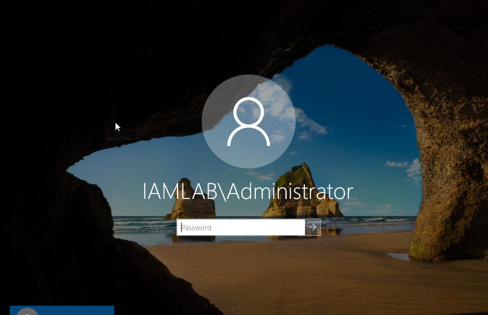

### Server Dashboard
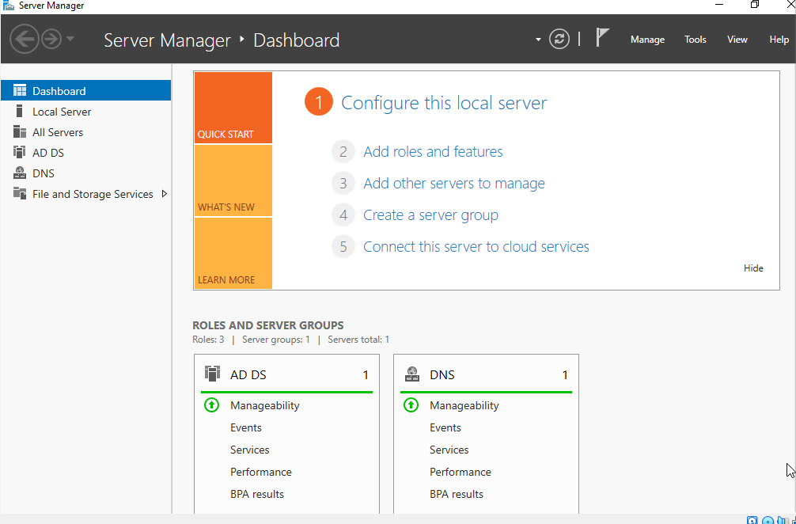

---

## 🔹 Domain & OU Structure

A domain (`iamlab.local`) was created with Organizational Units (OUs) to reflect departments:

- HR  
- IT  
- Finance  
- Disabled Users  

### Domain Structure
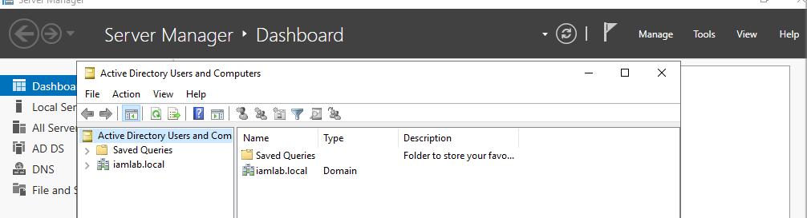

### OU Design
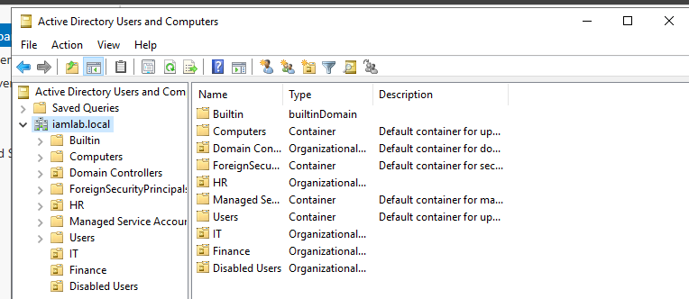

---

## 🔹 Security Groups (RBAC Foundation)

Security groups were created to manage access by role:

- HR_Group  
- IT_Admins  
- Finance_Read  

### Security Groups
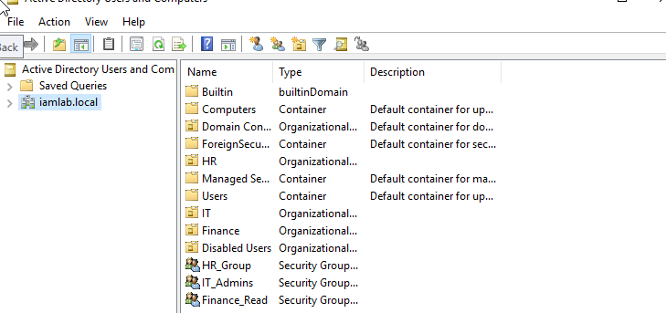

---

## 🔹 User Provisioning (Joiner)

New users were created and placed into the correct OU based on department.

### User Provisioning
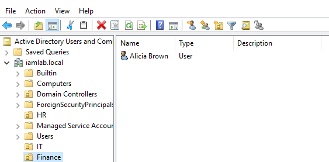

---

## 🔹 Role-Based Access Control (RBAC)

Users were assigned to security groups to grant appropriate access.

### User Assigned to Group
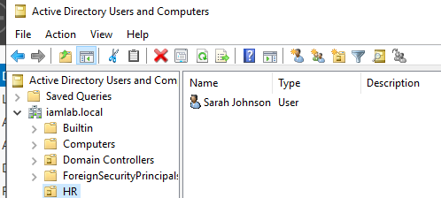

---

## 🔹 Access Validation (Before Role Change)

User access was reviewed to confirm current permissions aligned with job role.

### Before Role Change
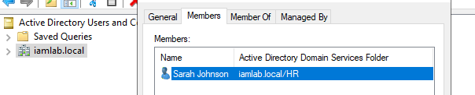

---

## 🔹 Role Change (Mover)

User access was updated after a role change by removing old permissions and assigning new ones.

### After Role Change
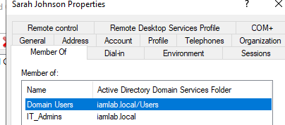

---

## 🔹 File/Folder Access Control

Permissions were applied to shared folders based on security group membership.

This enforces:
- Least privilege  
- Department-based access  
- Controlled resource access  

### Folder Permissions (RBAC Applied)
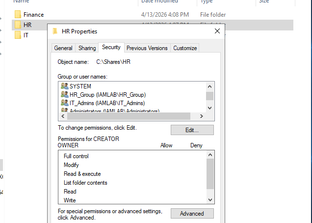

---

## 🔹 User Deprovisioning (Leaver)

User accounts were disabled and moved to a “Disabled Users” OU to remove access.

### Account Disabled
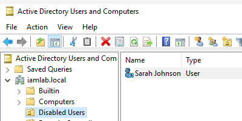

---

## 🔹 Administrative Access Control

Administrative privileges were assigned via group membership instead of directly to users.

### Admin Group Assignment
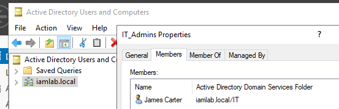

---

## 🔹 Key IAM Concepts Practiced

- User Lifecycle Management (Joiner, Mover, Leaver)  
- Role-Based Access Control (RBAC)  
- Least Privilege Principle  
- Access Reviews & Validation  
- Security Group Management  
- File/Folder Permission Management  
- Account Deprovisioning  
- Organizational Unit (OU) Design  

---

## 🔹 Why This Project Matters

This lab simulates how real organizations manage identity and access securely.

It demonstrates the ability to:
- Provision and manage users in Active Directory  
- Assign and validate access based on job roles  
- Enforce least privilege  
- Remove access during termination  
- Apply access control to resources  

---

## 🔹 Tools Used

- Active Directory Domain Services (AD DS)  
- Windows Server  
- Virtual Lab Environment  

---

## 🔹 Next Steps

- Perform formal access reviews with audit documentation  
- Map permissions to NIST controls  
- Expand into cloud IAM (AWS / Azure)  
